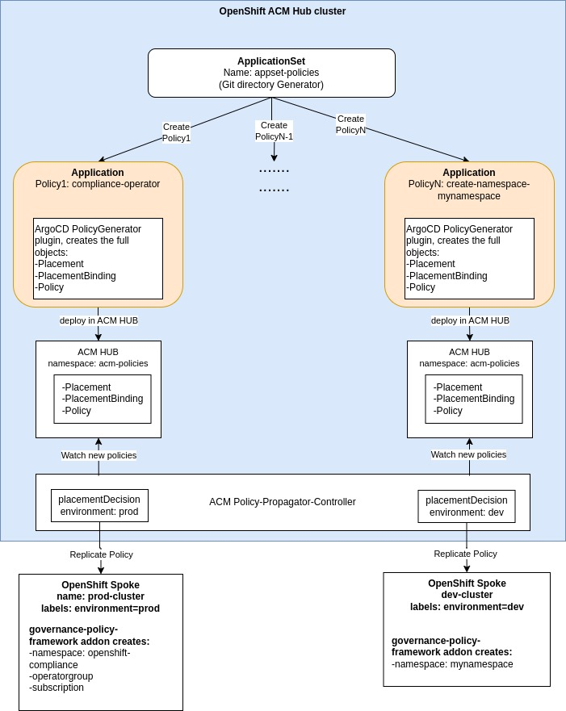

# Disclosure

Opinions expressed in this blog are my own and do not necessarily reflect that of the company I work for.


# Introduction

This repository demonstrates how to use Red Hat Advanced Cluster Management (ACM) together with GitOps (Argo CD ApplicationSet push model) and PolicyGenerator to deploy policies to selected spoke clusters.

An ApplicationSet using the Git directory generator is configured to deploy all policies defined under policies/*. For each policy, the ApplicationSet automatically creates an Application that ensures the policy is applied to the target clusters.

Repository structure example:
- boostrap/app directory: contains the ApplicationSet manifests
- boostrap/clustergroups directory: contains the MCE .....
- policies/*: Contains the Polcies that will be enforced, each child directory is one policy.

```
.
├── bootstrap
│   ├── app
│   │   └── 40-applicationset-governance.yaml
│   └── clustergroups
│       ├── 00-namespace.yaml
│       ├── 10-rbac.yaml
│       ├── 30-mce-mceprod.yaml
│       ├── 31-mce-mcedev.yaml
│       ├── 40-mc-mcprod.yaml
│       ├── 41-mc-mcdev.yaml
│       ├── 50-mcsb-mceprod.yaml
│       └── 51-mcsb-mcedev.yaml
...
...
├── policies
│   ├── compliance-operator
│   │   ├── kustomization.yaml
│   │   ├── manifests
│   │   │   ├── 00-namespace.yaml
│   │   │   ├── 10-operatorgroup.yaml
│   │   │   └── 20-subscription.yaml
│   │   └── policy-generator.yaml
│   ├── create-namespace-mynamespace
│   │   ├── kustomization.yaml
│   │   ├── manifests
│   │   │   └── namespace.yaml
│   │   └── policy-generator.yaml
```

The following diagram provides a high-level overview of the components involved, from the creation of the ApplicationSet to the enforcement of policies:



For more details on ACM policy architecture, see the community [documentation](https://open-cluster-management.io/docs/getting-started/integration/policy-controllers/policy-framework/).


# Prerequisites

Before using this repository, make sure you have:
- A running OpenShift cluster with Red Hat ACM installed.
- Two or more spoke clusters already imported into ACM. This repo expects that one cluster is named prod-cluster and other named dev-cluster, besides the local-cluster/ACM HUB cluster

# LAB Architecture 

The enviremont has 3 clusters, with the following naming: 
- local-cluster: this is the ACM HUB cluster (cluster where ACM is installed)
- prod-cluster: spoke cluster. For placement porpuses will be labeled with environment: prod
- dev-cluster: spoke cluster. For placement porpuses will be labeled with environment: dev

# How to use this Repository

## Summary of Configuration:
??1. Configure ArgoCD instance to use the PolicyGenerator plugin.
??1. Create the manifests of the bootstrap

??1. Label the target managed clusters with `environment=prod` (or adjust in policy-generator.yaml).

## Detailed Configuration

1. Login to ACM HUB cluster

    ```bash
    oc login -u <user> -p <password> <API_ENDPOINT>
    ```

2. Install Openshift-Gitops in ACM HUB cluster

    ```bash
    oc create -f bootstrap/gitops/00-namespace.yaml
    oc create -f bootstrap/gitops/10-operatorgroup.yaml
    oc create -f bootstrap/gitops/20-subscription.yaml
    ```

3. Give RBAC to allow the user you login to OpenShift or ArgoCD, to see in ArgoCD the applications created in ACM HUB OpenShift cluster

    ```bash
    oc create -f - <<EOF
    apiVersion: user.openshift.io/v1
    kind: Group
    metadata:
      name: cluster-admins
    users:
    - admin
    EOF
    ```

4. Configure ArgoCD instance to use the PolicyGenerator plugin.

    Documentation reference link: [Integrating the Policy Generator with OpenShift GitOps](https://docs.redhat.com/en/documentation/red_hat_advanced_cluster_management_for_kubernetes/2.13/html/gitops/gitops-overview#integrate-pol-gen-ocp-gitops) and [chapter](https://docs.redhat.com/en/documentation/red_hat_advanced_cluster_management_for_kubernetes/2.13/html/gitops/gitops-overview#gitops-policy-definitions).

    a. Clone Git

    ```
    git clone https://github.com/luisevm/acm-policies-gitops.git
    ```

    b. Find the imageContainer version for your ACM version:
    - Open https://catalog.redhat.com
    - Search by image multicluster-operators-subscription
    - Check the image versions available and select the image name that match your ACM version, in my case ACM version is 2.14 and the correspondent image is registry.redhat.io/rhacm2/multicluster-operators-subscription-rhel9:2.14.0-1752502331.

    c. Patch the ArgoCD adding the following configuration to the existing ArgoCD manifest:
    - Edit ArgoCD instance - in my case Im using the instance running in openshift-gitops namespace
        ```bash
        oc -n openshift-gitops edit argocd openshift-gitops
        ```
    - Patch ArgoCD

        ```
        apiVersion: argoproj.io/v1beta1
        kind: ArgoCD
        metadata:
          name: openshift-gitops
          namespace: openshift-gitops
        spec:
          kustomizeBuildOptions: --enable-alpha-plugins
          repo:
            env:
            - name: KUSTOMIZE_PLUGIN_HOME
              value: /etc/kustomize/plugin
            initContainers:
            - args:
              - -c
              - cp /policy-generator/PolicyGenerator-not-fips-compliant /policy-generator-tmp/PolicyGenerator
              command:
              - /bin/bash
              image: registry.redhat.io/rhacm2/multicluster-operators-subscription-rhel9:2.14.0-1752502331
              name: policy-generator-install
              volumeMounts:
              - mountPath: /policy-generator-tmp
                name: policy-generator
            volumeMounts:
            - mountPath: /etc/kustomize/plugin/policy.open-cluster-management.io/v1/policygenerator
              name: policy-generator
            volumes:
            - emptyDir: {}
              name: policy-generator
        ```

    d. Check that the ArgoCD instance restarts and that is goes running again

    ```
    oc -n openshift-gitops get pods
    ```

5. Bootstrap required Objects

    a. Create in ACM HUB the namespace where the Policyes will be saved 

    ```
    oc create -f bootstrap/clustergroups/00-namespace.yaml
    ```

    b.Configure the RBAC for the new namesapce to have auth......

    ```
    oc create -f bootstrap/clustergroups/10-rbac.yaml
    oc create -f bootstrap/clustergroups/11-rbac-admin.yaml
    ```

    c.

    ```
    oc create -f bootstrap/clustergroups/30-mce-mceprod.yaml
    ```

    d.
    ```
    oc create -f bootstrap/clustergroups/31-mce-mcedev.yaml
    ```

    e.
    ```
    oc create -f bootstrap/clustergroups/40-mc-mcprod.yaml
    oc label managedcluster prod-cluster cluster.open-cluster-management.io/clusterset=mceprod --overwrite
    oc label ManagedCluster prod-cluster environment=prod
    ```

    f.
    ```
    oc create -f bootstrap/clustergroups/41-mc-mcdev.yaml 
    oc label managedcluster dev-cluster cluster.open-cluster-management.io/clusterset=mcedev --overwrite
    oc label ManagedCluster dev-cluster environment=dev
    ```

    g.
    ```
    oc create -f bootstrap/clustergroups/50-mcsb-mceprod.yaml 
    ```

    h.
    ```
    oc create -f bootstrap/clustergroups/51-mcsb-mcedev.yaml
    ```

6. Create ApplicationSet

    a.
    ```
    oc create -f bootstrap/app/40-applicationset-governance.yaml
    ```

    b. Check that the AplicationSet was created that it created one Application per each Policy

    ```
    oc -n openshift-gitops get applications.argoproj.io
    ```

# Troubleshoot
Example to troubleshoot the Policy to audit the presence of the OpenShift-Gitops operator.

1. On the ACM HUB cluster

    ```bash
    oc -n acm-policy get policy
    oc -n acm-policy describe policy policy-audit-gitops-operator
    ```

    ```bash
    oc -n acm-policies get policy,placement,placementbinding
    ```

    - Verify that ApplicationSet was deployed
    ```bash
    oc -n openshift-gitops describe applicationset 
    ```

    - Open ArgoCD UI in a browser and verify all the Applications deployed

    - Verify Applications are created for each policy:

        ```bash
        oc -n openshift-gitops get applications.argoproj.io
        ```

    ```bash
    oc -n acm-policy get placement
    oc -n acm-policy describe placement gitops-targets
    ```

    ```bash
    oc -n acm-policy get placementdecision
    ```

    ```bash
    oc -n acm-policy describe policy <your-policy-name>
    oc -n prod-cluster get policy
    ```

2. On the spoke cluster

    #Verify Policy was propagated to the spoke cluster
    ```bash
    oc -n prod-cluster get policy
    oc -n prod-cluster describe policy acm-policies.policy-audit-gitops-operator
    ```

    #Look at policy-controller logs on the spoke
    ```bash
    oc -n open-cluster-management-agent-addon get pods | grep governance-policy-framework
    oc -n open-cluster-management-agent-addon logs <policy-framework-pod>
    ```
